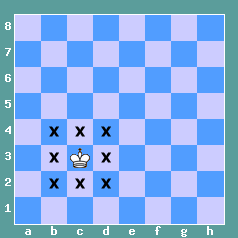
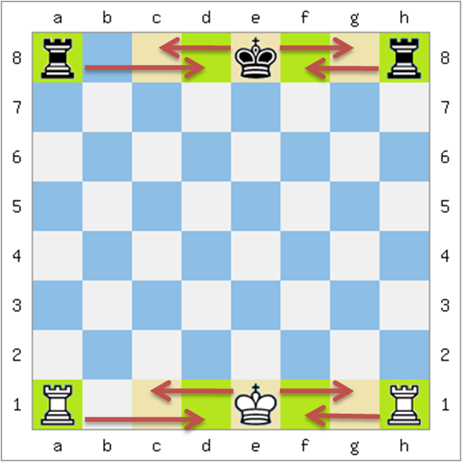
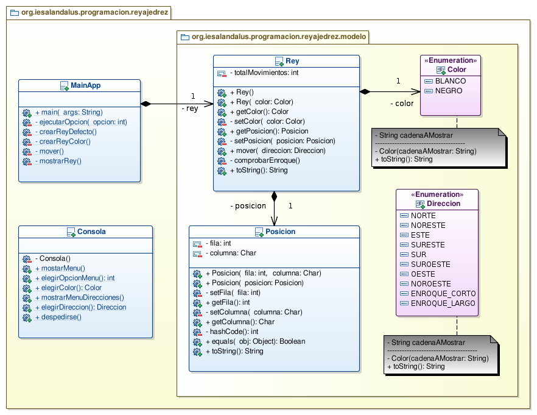

# Tarea Rey Ajedrez
## Profesor: Juan Antonio Muñoz Almansa
## Alumno:

La tarea va a consistir en modelar el movimiento de un rey de ajedrez por el tablero de dicho juego.

Imágenes obtenidas de la web: <a href="https://www.123ajedrez.com/reglas-basicas/la-dama">123ajedrez.com</a> (Enrique Moreno)

En la primera imagen puedes observar cuál es el posicionamiento inicial válido para los reyes dependiendo de su color. En la segunda imagen puedes apreciar cuáles son los movimientos válidos para un rey: horizontalmente, verticalmente y en diagonal, pero solamente una casilla.

Además, el rey tiene un movimiento especial, el enroque. Éste consiste en que el rey puede moverse junto con alguna de las torres segun se muestra en la siguiente imagen.

Imágenes obtenidas de la web: <a href="https://www.123ajedrez.com/reglas-basicas/la-dama">123ajedrez.com</a> (Enrique Moreno)

Para hacer el enroque debes tener en cuenta las siguientes condiciones:

- El rey siempre debe estar en su posición original.
- El rey nunca debe haberse movido previamente, es decir, el total de movimientos realizados debe ser 0.
- Existen dos tipos de enroque:
-- Enroque largo: El rey se moverá dos casillas a la izquierda.
-- Enroque corte: El rey se moverá dos casillas a la derecha.

En este repositorio GitHub hay un esqueleto de proyecto gradle que ya lleva incluidos todos los test necesarios que el programa debe pasar y las dependencias, entre ellas la de la librería entrada. 

Para ello te pongo un diagrama de clases para el mismo y poco a poco te iré explicando los diferentes pasos a seguir:

#### Primeros Pasos

1. Lo primero que debes hacer es un fork de este repositorio.
2. Clona tu repositorio remoto recién copiado en **GitHub** a un repositorio local que será donde irás realizando lo que a continuación se te pide. Modifica el archivo `README.md` para que incluya tu nombre en el apartado "Alumno". Realiza tu primer commit.

#### Enumerado `Direccion`

1. Crea un enumerado llamado `Direccion` que contenga los literales: `NORTE`, `NORESTE`, `ESTE`, `SURESTE`, `SUR`, `SUROESTE`, `OESTE`, `NOROESTE`, `ENROQUE_CORTO`,`ENROQUE_LARGO`. Realiza un commit.

#### Enumerado `Color`

1. Crea un enumerado llamado `Color` que contenga los literales: `BLANCO` y `NEGRO`. Los literales estarán parametrizados y a cada uno le pasaremos la representación en cadena de los mismos: Blanco o Negro. Realiza un commit.
2. Crea el atributo `cadenaAMostrar` (String). Realiza un commit.
3. Crea el **constructor** con la visibilidad adecuada, que almacenará en el atributo anterior la cadena que se le pase por parámetro.  Realiza un commit.
4. Crea el método `toString` que devolverá la representación en forma de cadena del literal. Realiza un commit.

#### Clase `Posicion`

1. Crea la clase `Posicion`. Crea los atributos `fila` (int) y `columna` (char) con la visibilidad adecuada. Realiza un commit.
2. Crea los métodos `get` y `set` para los atributos. Recuerda que para el método `set` se debe tener en cuenta que los valores indicados sean correctos (las filas van del 1 al 8 -ambos inclusive- y las columnas de la 'a' a la 'h' -ambas inclusive-) y si no se lance una excepción del tipo `IllegalArgumentException` con el mensaje adecuado. En caso de que la posición no sea la correcta no deben modificarse los atributos. Realiza un commit.
3. Crea un **constructor** para esta clase que acepte como parámetros la `fila` y la `columna` y que los asigne a los atributos si son correctos. Si no son correctos debe lanzar una excepción del tipo `IllegalArgumentException` con el mensaje adecuado. Para ello utiliza los métodos `set` anteriormente creados. Realiza un commit.
4. Crea el **constructor** copia para esta clase. Realiza un commit.
5. Crea los métodos `equals` y `hashCode` para esta clase. Realiza un commit.
6. Crea el método `toString` que devolverá un String y será la representación de la fila y la columna de forma adecuada **fila=valorFila, columna=valorColumna**. Realiza un commit.

#### Clase `Rey`

1. Crea la clase `Rey` cuyos atributos serán un color (del tipo enumerado Color), una posicion (de la clase Posicion) y un totalMovimientos (del tipo entero), con la visibilidad adecuada. Realiza un commit.
2. Crea los métodos get y set para cada atributo con la visibilidad adecuada. Los métodos set siempre comprobarán la validez de los parámetros pasados y si no son correctos deberá lanzar la excepción adecuada con el mensaje adecuado. Realiza un commit.
3. Crea un **constructor** por defecto para esta clase que cree un rey blanco en la posición "1e". Realiza un commit.
4. Crea un **constructor** para la clase que acepte como parámetro el color y que creará un rey de dicho color cuya posición será "1e" si es blanco o "8e" si es negro. Realiza un commit.
5. Crea el método mover que acepte como parámetro una Direccion. La dirección no puede ser nula o de lo contrario debe lanzar una excepción adecuada (NullPointerException o IllegalArgumentException) con el mensaje adecuado. Si no puede realizar dicho movimiento, debido a que el rey se sale del tablero o que no está permitido (mira las condiciones del enroque), se debe lanzar una excepción del tipo OperationNotSupportedException con un mensaje adecuado y no modificarán los atributos del rey. Si el movimiento si es válido, se modificará la posición actual del rey y se incrementará en uno el total de movimientos. Realiza un commit.
5. Crea el método `toString` que devuelva un String que será la representación de dicho objeto (color y posición). Realiza un commit.

#### Clase `Consola`

1. Crea la clase de utilidades `Consola`. Realiza un commit.
2. Crea el **constructor** para esta clase con su visibilidad adecuada, teniendo en cuenta que será una clase de utilidades que sólo contendrá métodos estáticos. Realiza un commit.
3. Crea el método `mostrarMenu` que mostrará el menú con las opciones de nuestra aplicación: crear rey por defecto, crear rey eligiendo el color, mover y salir. Realiza un commit.
4. Crea el método `elegirOpcionMenu` que mostrará un mensaje para que elijamos una opción del menú anteriormente creado y nos pedirá que introduzcamos por teclado la opción hasta que ésta sea valida. Devolverá la opción elegida. Realiza un commit.
5. Crea el método `elegirOpcion` que nos pedirá que elijamos un color mientras éste no sea válido y dependiendo de la opción elegida devolverá un color u otro. Realiza un commit.
6. Crea el método `mostrarMenuDirecciones` que mostrará por consola un menú con las diferentes direcciones que podemos elegir. Realiza un commit.
7. Crea el método `elegirDireccion` que mostrará un mensaje indicando que elijamos una dirección del menú anteriormente creado y nos pedirá que introduzcamos por teclado la opción hasta que ésta sea valida. Devolverá la dirección elegida. Realiza un commit.
8. Crea el método `despedirse` que mostrará un mensaje de despedida de nuestra aplicación.

#### Clase `MainApp`

1. Crea el atributo de clase `reina`. Realiza un commit.
2. Crea el método `ejecutarOpcion` que dependiendo de la opción pasada como parámetro, actuará en consecuencia. Realiza un commit.
3. Crea el método `crearReyDefecto` que asignará al atributo de clase rey una nueva instancia de una rey creado con el constructor por defecto. Realiza un commit.
4. Crea el método `crearReyColor` que asignará al atributo de clase rey una nueva instancia de una rey creado con el constructor al que le pasamos el color. Realiza un commit.
5. Crea el método `mover` que mostrará un menú con las posibles direcciones, nos preguntará por la dirección y la cantidad de pasos a mover y moverá el rey según esos parámetros. Realiza un commit.
6. Crea el método `mostrarRey` que nos mostrará la información del rey si éste está creado o de lo contrario nos informará de ello.
7. Crea el método `main` que será el método principal de nuestra aplicación y deberá iterar mostrando el menú principal, pidendo la opción y ejecutándola mientras no elijamos salir, en cuyo caso mostrará un mensaje de despedida y nuestra aplicación finalizará. Realiza un commit y realiza el push a tu repositorio remoto en GitHub.

#### Se valorará:

- La indentación debe ser correcta en cada uno de los apartados.
- Los identificadores utilizados deben ser adecuados y descriptivos.
- Se debe utilizar la clase `Entrada` para realizar la entrada por teclado que se encuentra como dependencia de nuestro proyecto en la librería `entrada`.
- El programa debe pasar todas las pruebas que van en el esqueleto del proyecto y toda entrada del programa será validada, para evitar que el programa termine abruptamente debido a una excepción.
- La corrección ortográfica tanto en los comentarios como en los mensajes que se muestren al usuario.
